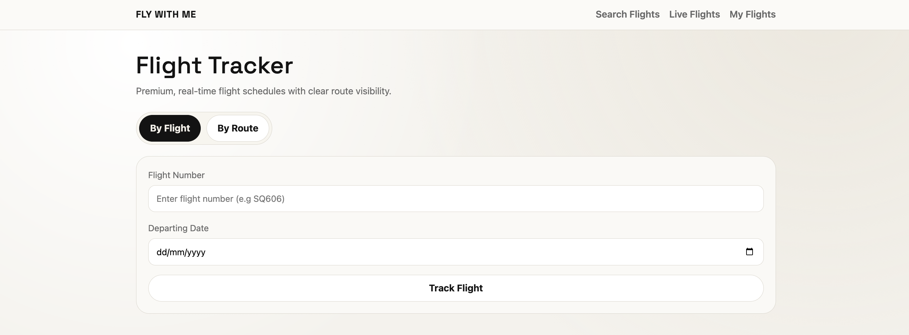
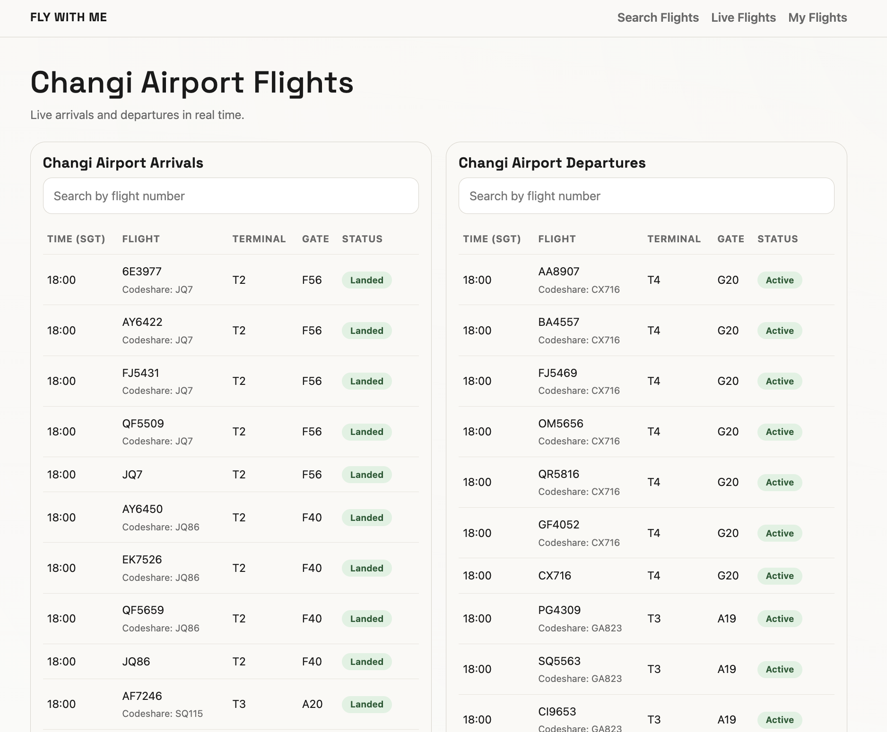
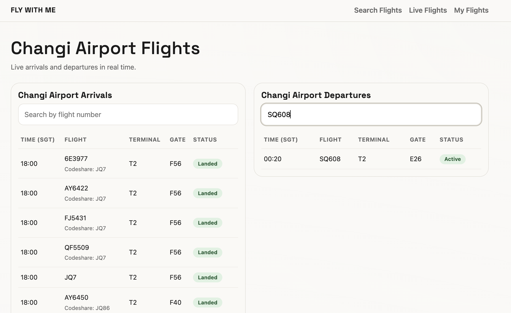
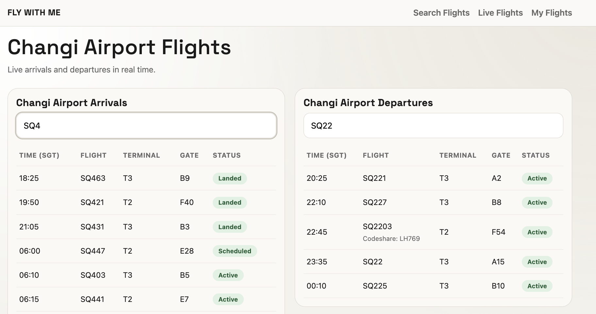
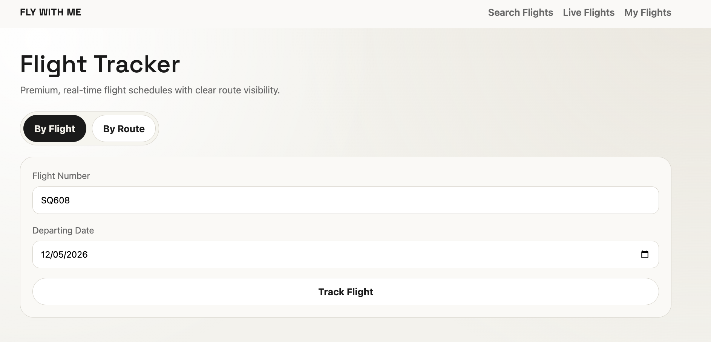
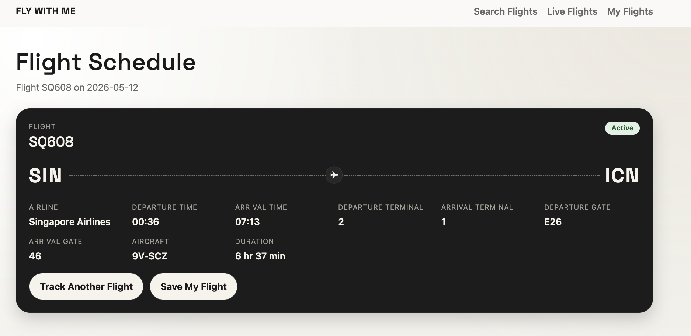
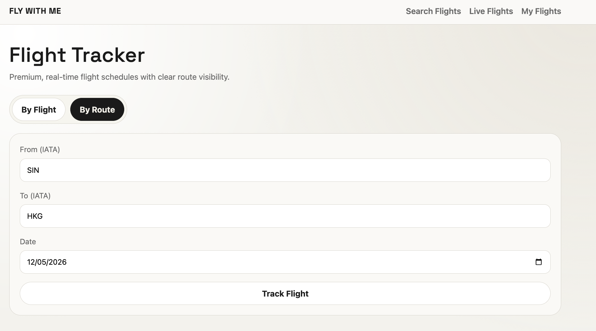
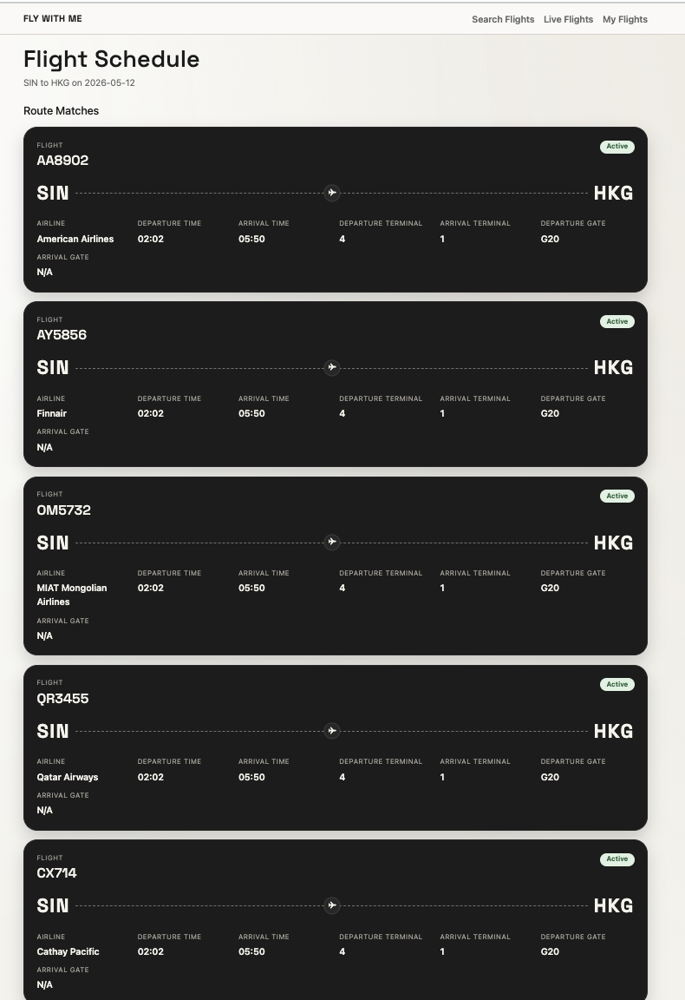
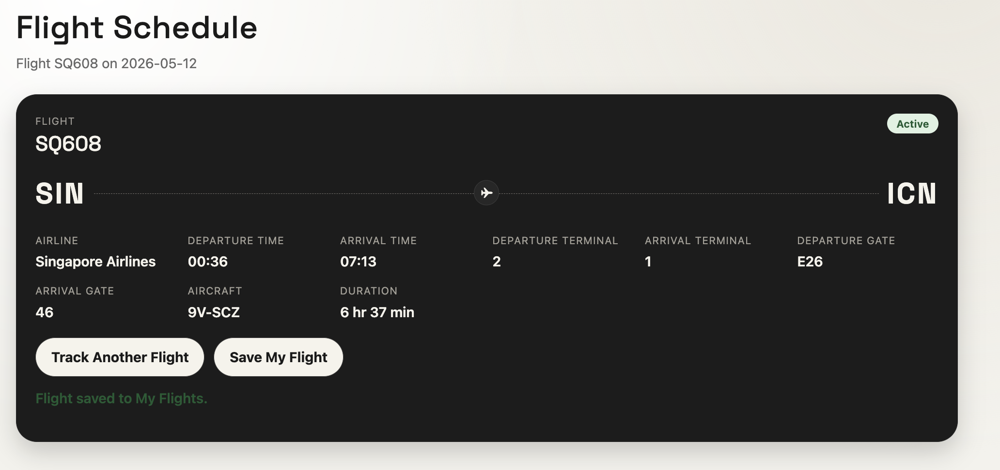
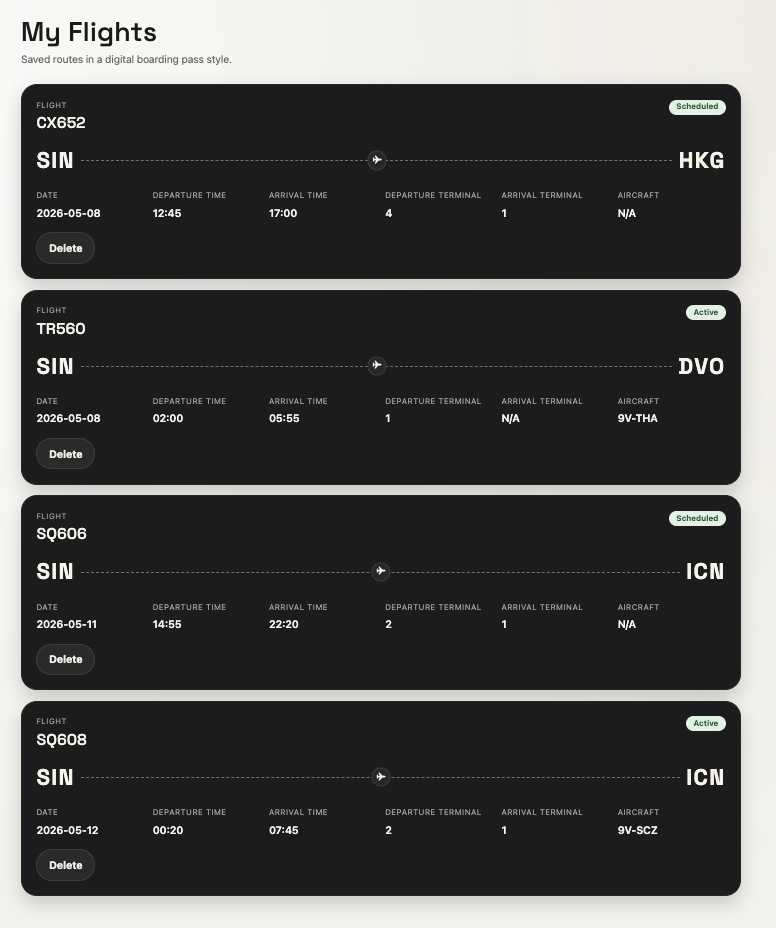

## Flight Schedule

### Description

As someone who frequently travels, I would love to have a flight tracker to keep track of my flight details. I have created Changi flight tracker to further elevate my travel experience. The Changi Flight Tracker is a React Web application that allows users to search, track, and save flights operating through Singapore Changi Airport

The app connects to the Aviation Edge Timetable API to retrieve real-time flight data, and uses Airtable as a backend database to store and manage a personalised list of saved flights

### Features

- **Live Flights:** View real-time arrivals and departures at Changi Airport. Filter flights by flight number using the search bar on each table.
- **Flight Search:** Search for a specific flight by flight number and date, or by route (origin and destination) and date.
  Results are fetched live from the Aviation Edge API and display full flight details including terminals, aircraft type, and duration.
- **Save Flights:** Save any flight from the search results directly into your personal flight list, stored in Airtable.
- **My Flights:** View all your saved flights displayed as boarding pass style cards, showing route, departure and arrival times, terminals, aircraft, and status. Delete any flight you no longer wish to track.

### Tech Stack

| Technology        | Purpose                                         |
| ----------------- | ----------------------------------------------- |
| React             | Frontend UI framework                           |
| React Router      | Page navigation and URL-based routing           |
| Aviation Edge API | Live flight data (Arrivals & Departures)        |
| Airtable API      | Storing, retrieving, and deleting saved flights |
| Vite              | Development build tool                          |
| CSS               | Custom styling                                  |

### Concepts Applied

**Component-based architecture:** UI split into reusable components (ArrivalsTable, DeparturesTable, FlightSearchBar, etc.)

**Lifting State:** Search state is lifted up to LiveFlightsPage and shared between FlightSearchBar and the table components as siblings

**API integration:** Fetching live data from Aviation Edge and performing CRUD operations (Create, Read, Delete) on Airtable

**URL query parameters:** Search inputs are passed between pages via URL params, enabling shareable and bookmarkable search results

**Conditional rendering:** Loading, error, and empty states are handled and displayed across all pages

### Live Flights Graphical Interface

**Default _Live Flights_ Page**

**Input flight number into single search bar**

**Input flight number into both of the search bar**

### Search by Flight Number & Date

**Search Results**

### Search by Route

**Search Results**

### Save Flight

User will click on "Save my Flight"

It will appear on "My Flights" which shows the list of flights user has saved.

